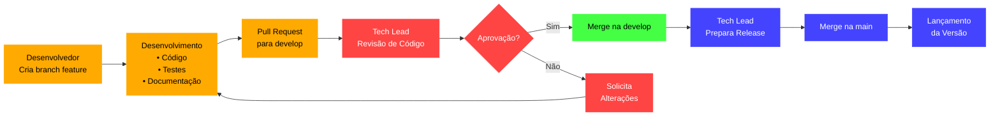

# 🏢 Nome do Projeto XYZ

[](https://github.com/nome-empresa/projeto-xyz)
[](https://github.com/nome-empresa/projeto-xyz/releases)
[](https://github.com/nome-empresa/projeto-xyz/blob/main/LICENSE)

---

## 📋 Descrição do Projeto

Breve descrição do objetivo e escopo do projeto, incluindo:
- Propósito principal
- Área de atuação
- Benefícios esperados
- Público-alvo

---

## 🎯 Objetivos do Projeto

- Lista numerada dos objetivos principais
- Metas específicas
- Resultados esperados
- Métricas de sucesso

---

## 👥 Equipe Responsável

### Liderança
- **Product Owner:** [Marcelo Patricio](https://github.com/MarceloP25)
- **Tech Lead:** [Karla Ferreira](https://github.com/kfrural)
- **Team Lead:** Nome Sobrenome
- **Development Lead:** Nome Sobrenome
- **Design Lead:** Nome Sobrenome

### Colaboradores
- Developers:
  * Nome Sobrenome (@github-username)
  * Nome Sobrenome (@github-username)
- Designers:
  * Nome Sobrenome (@github-username)
  * Nome Sobrenome (@github-username)

---

## 🚀 Começando

### Pré-requisitos
- Lista de dependências necessárias
- Versões mínimas requeridas
- Ambiente necessário

### Instalação
```bash
# Exemplo de comandos de instalação
git clone https://github.com/nome-empresa/projeto-xyz.git
cd projeto-xyz
npm install
```

### Configuração
- Instruções de configuração inicial
- Variáveis de ambiente necessárias
- Configurações específicas

---

## 🛠️ Tecnologias Utilizadas

| Tecnologia | Versão | Descrição |
|------------|--------|-----------|
| Frontend   | X.Y.Z  | Framework principal |
| Backend    | W.V.U  | Tecnologia utilizada |
| Database   | A.B.C  | Sistema de banco de dados |

---

## 📊 Padrões e Boas Práticas

### Commit Messages

- Utilizar formato padronizado
- Exemplo: `[fix] Correção de bug no login`
- Referência aos tickets: `[PROJ-001] Implementação da funcionalidade X`

### Code Reviews

- Critérios de aprovação
- Checklist de verificação
- Marcar o tech lead para revisar sempre

### Estrutura de Branches

- Cada desenvolvedor possui sua própria branch de feature
- Branch `develop` como branch principal de desenvolvimento
- Branch `main` protegida para releases
- Pull requests obrigatórios para `develop`
- Apenas tech lead pode:
          - Realizar merges na `main`
  - Lançar novas versões
  - Revisar código


### Fluxo de Trabalho

Criação de Branches- Desenvolvedores criam branches a partir da `develop`
- Nome do branch segue padrão: `dev_[desenvolvedor]`
- Exemplo: `dev_ana`

Desenvolvimento e Pull Requests- Desenvolvedores trabalham em suas branches individuais
- Criam pull requests para a branch `develop`
- Pull requests devem incluir:
  - Descrição do que foi feito
  - Descrição de resultado esperado
  - Referência ao ticket relacionado
  - Screenshots quando aplicável


Code Review- Tech lead realiza revisão completa do código
- Verifica:
  - Seguimento dos padrões de commit
  - Qualidade do código
  - Documentação necessária
  - Testes unitários


- Aprovação é obrigatória antes do merge

Lançamento- Tech lead é responsável por:
  - Criar tags de versão
  - Gerar documentação de release
  - Realizar deploy para produção




### Instruções de Implementação

Configuração Inicial
```bash
# Proteger branch main
git branch --set-upstream-to=origin/main main
git remote set-branch origin main --push

# Criar branch develop
git checkout -b develop
git push -u origin develop
```

Criando Branches de Feature
```bash
# Criar nova branch a partir da develop
git checkout develop
git checkout -b dev_[seu-nome]

# Exemplo:
git checkout develop
git checkout -b dev_ana
```

Fluxo de Trabalho Diário
```bash
# Iniciar trabalho em nova feature
git checkout -b dev_[seu-nome]
git push -u origin dev_[seu-nome]

# Durante o desenvolvimento
git add .
git commit -m "[tipo] Descrição da alteração [PROJ-XXX]"
git push origin dev_[seu-nome]

# Criar pull request para develop no GitHub/GitLab
```
---

## 📈 Métricas e Monitoramento

- Indicadores principais
- Ferramentas utilizadas
- Frequência de medição

---

## 📝 Documentação Adicional

- Links para documentações específicas
- Guias de estilo
- Políticas de segurança

---

## 📅 Roadmap

- Planos futuros
- Prioridades
- Timeline estimado

---

## 📋 Licença
Este projeto é licenciado sob a licença MIT. Veja o arquivo [LICENSE](LICENSE) para mais detalhes.

---

## 📞 Contato
Para dúvidas ou sugestões, entre em contato com:
- Email:  emcomprp@gmail.com
- Slack: http://www.emcomp.com.br
