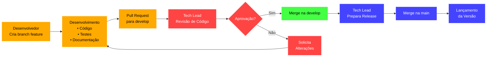

# 📰 Portal de Notícias

[](https://github.com/nome-empresa/projeto-xyz)
[](https://github.com/nome-empresa/projeto-xyz/releases)
[](https://github.com/nome-empresa/projeto-xyz/blob/main/LICENSE)


---

## 📋 Descrição do Projeto

- Objetivo Principal: Criar um portal de notícias online funcional e responsivo.
- Área de atuação: Jornalismo local e regional.
- Benefícios esperados: Centralizar informações da cidade em um único espaço digital, com navegação intuitiva e rápida.
- Público-alvo: Moradores de Rio Pomba, estudantes, comerciantes e comunidade em geral.

---

## 🎯 Objetivos do Projeto

- Construir uma aplicação web moderna e responsiva.
- Garantir fácil navegação e leitura das notícias.
- Aplicar práticas de desenvolvimento ágil (Scrum, Git e GitHub).
- Estruturar versionamento organizado com branches e PRs.
- Envolver time multidisciplinar (dev, design, financeiro).

**Resultados esperados**:
- Plataforma funcional disponível para a comunidade.
- Equipe alinhada em práticas modernas de desenvolvimento.
- Aprendizado coletivo em tecnologias web e metodologias ágeis.

---

## 👥 Equipe Responsável

### Liderança
- **Product Owner:** [Marcelo Patricio](https://github.com/MarceloP25)
- **Tech Lead:** [Karla Ferreira](https://github.com/kfrural)
- **Team Lead:** [Guilherme Bernardino](https://github.com/Guilherme-ber)
- **Development Lead:** [Vinícius Reis](https://github.com/ViniPlugner)
- **Design Lead:** [Luan Rodrigues](https://github.com/lgrodriguess)

### 👥 Colaboradores

#### 💻 Desenvolvedores
- [Vinícius Reis](https://github.com/ViniPlugner)
- [Andrei Gomes](https://github.com/AndreiGTeixeira)
- [João Matheus Filgueira](https://github.com/JoaoMFSerafim)

#### 🎨 Designers
- [Luan Rodrigues](https://github.com/lgrodriguess)
- [Andrei Gomes](https://github.com/AndreiGTeixeira)
- [João Matheus Filgueira](https://github.com/JoaoMFSerafim)
- [Vinícius Reis](https://github.com/ViniPlugner)

---

## 🚀 Começando

### Pré-requisitos
- Dependências globais:
  * Node.js (necessário para rodar React e Vite)
  * NPM ou Yarn (vem junto com o Node)
  * Git (para clonar e versionar)
  * VS Code (opcional, mas recomendado)
- Versões mínimas requeridas:
  * Node.js: v22.16.0 ou superior
  * NPM/Yarn: A que vier instalada com o Node
  * React/Vite: Latest
- Ambiente necessário:
  * Sistema operacional (Windows, Linux, MacOS)
  * Navegador moderno (Chrome, Firefox, Edge)

### Instalação
```bash
# Exemplo de comandos de instalação
git clone https://github.com/nome-empresa/projeto-xyz.git
cd projeto-xyz

npm install
npm install @hcaptcha/react-hcaptcha
npm i --save @fortawesome/react-fontawesome@latest
npm i --save @fortawesome/fontawesome-svg-core
npm i --save @fortawesome/free-solid-svg-icons
npm i --save @fortawesome/free-regular-svg-icons
npm i --save @fortawesome/free-brands-svg-icons

# Rodar em modo de desenvolvimento
npm run dev

# O projeto estará disponível em:
# http://localhost:5173 (ou a porta que o Vite indicar)

# Rodar em produção
npm run build
# O conteúdo gerado ficará na pasta 'dist/'
```

---

## 🛠️ Tecnologias Utilizadas

| Tecnologia            | Versão | Descrição                     |
| --------------------- | ------ | ----------------------------- |
| HTML, CSS, JavaScript | Latest | Tecnologias básicas da web    |
| React                 | Latest | Framework frontend            |
| Vite                  | Latest | Build tool para React         |
| Firebase              | —      | Autenticação e banco de dados |
| Java Spring           | Latest | Backend futuro (em avaliação) |
| Figma                 | —      | Ferramenta de Prototipação    |

---

### 📊 Padrões e Boas Práticas

### Commit Messages
- **Formato padronizado:** `[tipo] Descrição da alteração [PROJ-XXX]`
- **Objetivo:** Garantir histórico claro, rastreável e organizado.

### Exemplos de commits
| Tipo      | Exemplo de Commit                                      | Descrição                                     |
|----------|--------------------------------------------------------|-----------------------------------------------|
| feat     | `[feat] Criação da página de login`         | Nova funcionalidade adicionada               |
| fix      | `[fix] Correção no layout responsivo do Header` | Correção de bug                              |
| style    | `[style] Padronização de espaçamentos no Footer` | Alterações de formatação ou aparência       |
| docs     | `[docs] Atualização do README com instruções de instalação` | Alterações apenas na documentação           |
| refactor | `[refactor] Reestruturação da lógica de rotas` | Refatoração de código sem alterar comportamento |
| test     | `[test] Adição de testes unitários para o Header` | Inclusão ou ajuste de testes                 |
| chore    | `[chore] Configuração inicial do ESLint e Prettier` | Tarefas de manutenção do projeto            |

### Code Reviews:
- Pull Requests obrigatórios
- Revisão pelo Tech Lead antes do merge
- Verifica:
  - Seguimento dos padrões de commit
  - Qualidade do código
  - Documentação necessária
  - Testes unitários
- Marcar o tech lead para revisar sempre
  
### Estrutura de Branches:
- Cada desenvolvedor possui sua própria branch de feature
- Branch `develop` como branch principal de desenvolvimento
- Branch `main` protegida para releases
- Pull requests obrigatórios para `develop`
- Apenas tech lead pode:
          - Realizar merges na `main`
  - Lançar novas versões
  - Revisar código

### Fluxo de Trabalho:
- Criar branch a partir da develop
- Implementar feature
- Abrir PR para develop
- Tech Lead revisa e aprova
- Merge realizado somente com aprovação

### Desenvolvimento e Pull Requests:
- Desenvolvedores trabalham em suas branches individuais
- Criam pull requests para a branch `develop`
- Pull requests devem incluir:
  - Descrição do que foi feito
  - Descrição de resultado esperado
  - Referência ao ticket relacionado
  - Screenshots quando aplicável

### Lançamento:
- Tech lead é responsável por:
  - Criar tags de versão
  - Gerar documentação de release
  - Realizar deploy para produção

### Acessibilidade:
 Uso de boas práticas como:
  * Contraste adequado de cores
  * Texto legível
  * Uso de `alt` em imagens
  * Navegação por teclado
  * Testes com ferramentas como WAVE

 Boas práticas de código:
  * HTML semântico
  * CSS modularizado e reaproveitável
  * Responsividade e clareza visual
  * Componentização no React
  * Um arquivo CSS para cada arquivo .jsx

### 🎨 Padrão de Cores
Este projeto utiliza as seguintes cores principais:

| Código Hex | Cor Visual                                                                       |
|------------|----------------------------------------------------------------------------------|
| `#0A0A0A`  |  Preto            |
| `#38332E`  |  Cinza escuro     |
| `#FFFFFF`  |  Branco           |
| `#FF4000`  |  Laranja vibrante |
| `#FDDD0D`  |  Amarelo forte    |


---

### 📂 Estrutura do Projeto

workspace/portal  
│  
├── public/                  # Arquivos públicos (ícones, imagens, favicon, etc.)  
│   ├── images/  
│   ├── icons/  
│   └── index.html  
│  
├── src/  
│   ├── assets/              # Fontes, imagens e recursos estáticos  
│   ├── components/          # Componentes reutilizáveis React  
│   ├── pages/               # Páginas da aplicação  
│   ├── services/            # APIs, Firebase, etc.  
│   ├── styles/              # Estilos  
│   ├── utils/               # Funções utilitárias  
│   ├── App.jsx              # Componente principal  
│   ├── index.js             # Ponto de entrada  
│   └── routes.jsx           # Configuração de rotas  
│  
├── .gitignore               # Arquivo para ignorar arquivos/pastas no Git
└── README.md                # Este documento

---

### Instruções de Implementação

Configuração Inicial
```bash
# Proteger branch main
git branch --set-upstream-to=origin/main main
git remote set-branch origin main --push

# Criar branch develop
git checkout -b develop
git push -u origin develop
```

Criando Branches de Feature
```bash
# Criar nova branch a partir da develop
git checkout develop
git checkout -b dev_[seu-nome]

# Exemplo:
git checkout develop
git checkout -b dev_ana
```

Fluxo de Trabalho Diário
```bash
# Iniciar trabalho em nova feature
git checkout -b dev_[seu-nome]
git push -u origin dev_[seu-nome]

# Durante o desenvolvimento
git add .
git commit -m "[tipo] Descrição da alteração [PROJ-XXX]"
git push origin dev_[seu-nome]

# Criar pull request para develop no GitHub/GitLab
```
---

## 📈 Métricas e Monitoramento

- Indicadores principais
- Ferramentas utilizadas
- Frequência de medição

---

## 📝 Documentação Adicional

- Padrões de design no Figma
- Guia de estilos CSS (BEM, mobile-first)
- Políticas de acessibilidade

---

## 📅 Roadmap

- Integração com API de notícias
- Autenticação de usuários (Firebase)
- Painel administrativo para redatores
- Sistema de comentários nas notícias
- Deploy em servidor de produção

---

## 🔌 Extensões recomendadas no VS Code e navegador

### ✅ **Obrigatórias (VS Code)**

- [ESLint](https://marketplace.visualstudio.com/items?itemName=dbaeumer.vscode-eslint): Ajuda a manter o código limpo, identificando erros e padrões de má prática em JavaScript/React.

- [Prettier](https://marketplace.visualstudio.com/items?itemName=esbenp.prettier-vscode): Formata automaticamente seu código, mantendo uma padronização visual (espaços, quebras de linha, etc.).

> Estas extensões são OBRIGATÓRIAS e essenciais para garantir qualidade, organização e padronização do código.


### 🧩 **Opcionais (VS Code)**

- [Path Intellisense](https://marketplace.visualstudio.com/items?itemName=christian-kohler.path-intellisense): Autocompleta automaticamente caminhos de arquivos e diretórios ao importar imagens, componentes, estilos e outros arquivos.

- [Auto Rename Tag](https://marketplace.visualstudio.com/items?itemName=formulahendry.auto-rename-tag): Renomeia automaticamente a tag de fechamento ao alterar a tag de abertura em arquivos HTML ou JSX.

- [Bracket Pair Colorizer 2](https://marketplace.visualstudio.com/items?itemName=CoenraadS.bracket-pair-colorizer-2): Destaca colchetes, chaves e parênteses com cores distintas, facilitando a leitura de blocos de código aninhados.

- [GitLens](https://marketplace.visualstudio.com/items?itemName=eamodio.gitlens): Exibe informações avançadas de Git, como autores de linha, histórico de commits, comparações entre branches e muito mais diretamente no editor.

- [Error Lens](https://marketplace.visualstudio.com/items?itemName=usernamehw.errorlens): Mostra erros e avisos inline, com destaque visual direto nas linhas afetadas, agilizando a identificação de problemas no código.

> Estas extensões são recomendadas para melhorar produtividade e experiência no desenvolvimento, mas NÃO são obrigatórias.


### 🌐 **Extensões de navegador**

- [Responsive Viewer](https://chromewebstore.google.com/detail/responsive-viewer/inmopeiepgfljkpkidclfgbgbmfcennb?hl=pt-BR&utm_source=ext_sidebar): Simula visualizações de diferentes dispositivos ao mesmo tempo (celular, tablet, desktop), ideal para testar o layout responsivo.

- [Material Icons for GitHub](https://chromewebstore.google.com/detail/material-icons-for-github/bggfcpfjbdkhfhfmkjpbhnkhnpjjeomc?hl=pt-BR&utm_source=ext_sidebar): Adiciona ícones visuais aos repositórios no GitHub, facilitando a navegação e identificação de arquivos e pastas.

- [Retire.js](https://chromewebstore.google.com/detail/retirejs/djkbihbnjhkjdocoafobidefhephglfd): Detecta bibliotecas JavaScript desatualizadas ou vulneráveis no código de páginas web. Útil para análise e segurança durante o desenvolvimento.

> Estas extensões de navegador são OPCIONAIS e visam facilitar testes e análises durante o desenvolvimento.

---

### 🔗 Links úteis 
   * Códigos prontos: https://github.com/WebdevShefali/Web-Dev-Resources?tab=readme-ov-file#web-development-resources
---

### 📚 Recursos para Aprender Tecnologias Web

Aqui estão alguns sites interativos e didáticos para aprender as principais tecnologias de desenvolvimento web:

- **JavaScript** → [warriorjs.com](https://warriorjs.com)  
  Aprenda JavaScript jogando como um guerreiro que programa para vencer desafios.

- **CSS** → [flukeout.github.io](https://flukeout.github.io)  
  Pratique seletores CSS com um jogo divertido e visual.

- **Git** → [ohmygit.org](https://ohmygit.org)  
  Um jogo educativo para entender como o Git funciona na prática.

- **HTML** → [w3schools.com/html](https://www.w3schools.com/html/)  
  Comece com a base da web usando tutoriais diretos e exemplos interativos.

- **React** → [react.dev](https://react.dev/)  
  Documentação oficial com guias passo a passo e playgrounds para aprender React.

---

## 📋 Licença
Este projeto é licenciado sob a licença MIT. Veja o arquivo [LICENSE](LICENSE) para mais detalhes.

---

## 📞 Contato
Para dúvidas ou sugestões, entre em contato com:
- Email:  emcomprp@gmail.com
- Slack: http://www.emcomp.com.br
